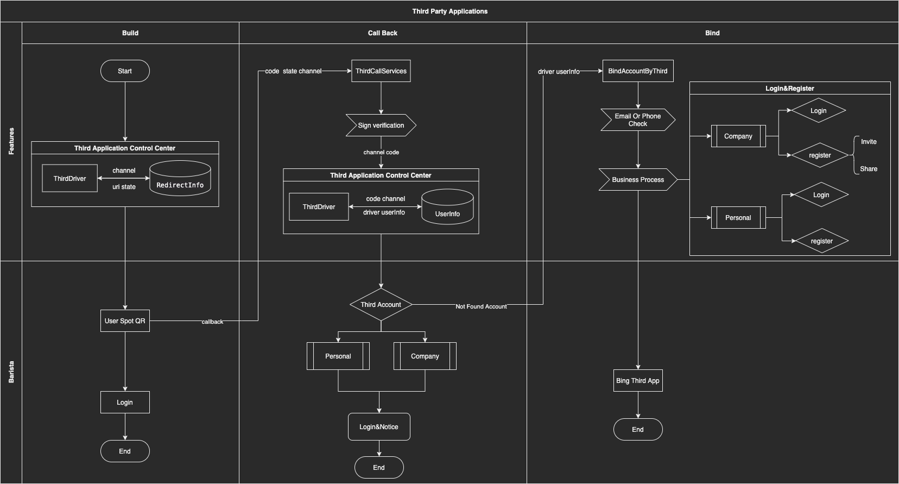

# 登录认证

## 代码结构

- Service 逻辑层
    - ThirdLogin 第三方登录模块
        - Dinging ... 第三方应用服务目录
        - ..... 其他服务目录
        - DriverModel.php 定义标准结构输出结果
        - ThirdDriver.php 输出层 输出第三方应用 认证结果

## 业务支持

- 据渠道定义回调信息(auth/thirdlogin/getThirdRedirect)
    - 正常登录
    - 邀请登录注册
    - 游客登录注册

- 第三方应用登录回调通用处理（auth/thirdlogin/callback）
    - 企业版&个人版 登录注册
    - 邀请登录注册（企业版）
    - 游客登录 (个人版)

# 第三方登录对接流程

- 一. 增加配置项
    - 新增常量
        - ``` AuthConstMap```  类下声明渠道标识
    - config说明
        - driver 服务渠道详细配置 key,app_id...
        - open_third_services 设置已开启服务渠道
        - third_services_by_personal 个人版对外开放渠道
    - 常量配置
        - ``` AuthConstMap::OPEN_THIRD_SERVICE_MAP ``` 渠道对接实现类 映射配置
        - ``` AuthConstMap::CHANNEL_NAME_MAP ``` 渠道名称配置
- 二. 实现第三方应用接入工厂类
    - 路径 Modules/Auth/Services/ThirdLogin 新建 第三方应用接入类
    - 构建单例模式 实现 ``` ThirdLoginInterface ``` 方法
    - 用户信息使用 标准模式统一输出 : ``` new DriverModel($data) ```
    - 回调信息使用 输出结构为 ```["qr_url"=>'redirect uri.....']```
    - 对接结构 demo

```injectablephp
class {$channelClass} implements ThirdLoginInterface
{

	/**
	 * @var BaiduDriver
	 */
	private static $_instance;
	/**
	 * @var array
	 */
	private $config;

	private function __construct()
	{

	}

	/**
	 * @param $config
	 *
	 * @return {$channelClass}
	 */
	public static function client($config): {$channelClass}
	{
		if (!self::$_instance instanceof self) {
			self::$_instance = new self();
		}

		self::$_instance->config = $config;

		return self::$_instance;
	}

	public function redirect($params): array
        {
             $url['qr_url'] = '.....';
             return $url;
        }
        public function userInfo($params): {$channelClass}
        {
             $data = [
                   ...
             ];
            return new DriverModel($data);
        }
}
```

## 业务流程

- 