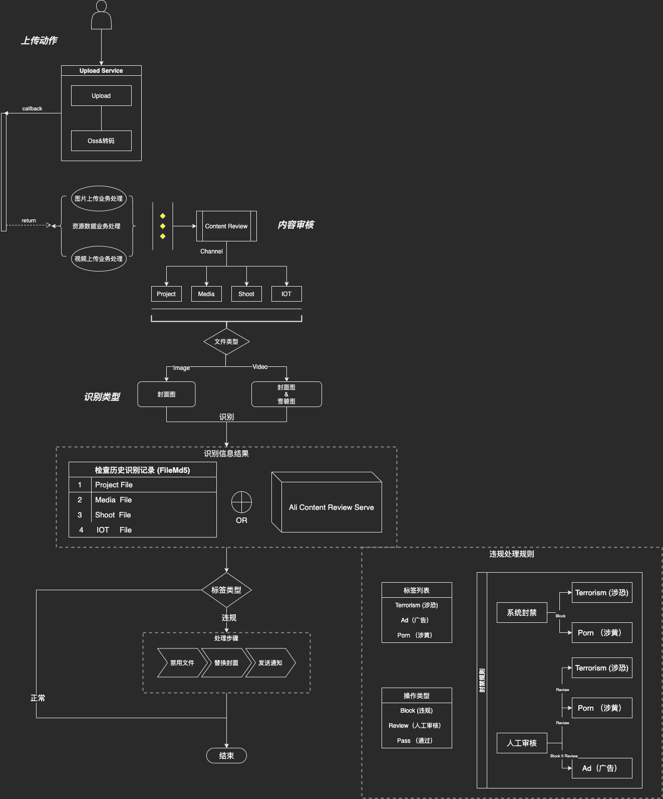

# 内部API-公共通用模块

## 图片内容审核

- 识别类型
    - 涉黄
    - 涉政
    - 广告
    - 暴力
- 审核方式
    - 系统自动禁用 （涉政,涉黄）
    - 人工审核 （其他标签类型或识别相似度分支较低）
    - 注：封禁后的内容 封面图会被替换(上一级文件夹封面也会替换) 解禁会还原封面图
- 渠道
    - 项目 3
    - 摄影 2
    - 媒资 1
    - IOT 4
- 格式
  - 视频 (雪碧图/封面)
  - 图片

- 标记
  - 标记字段为 file_status 值为-5 为系统禁用状态 其他值跟随【源文件表】字段
  - 注: 除鉴黄鉴暴外业务 不建议使用此字段作为其他业务上判断

## 业务流程图

- 