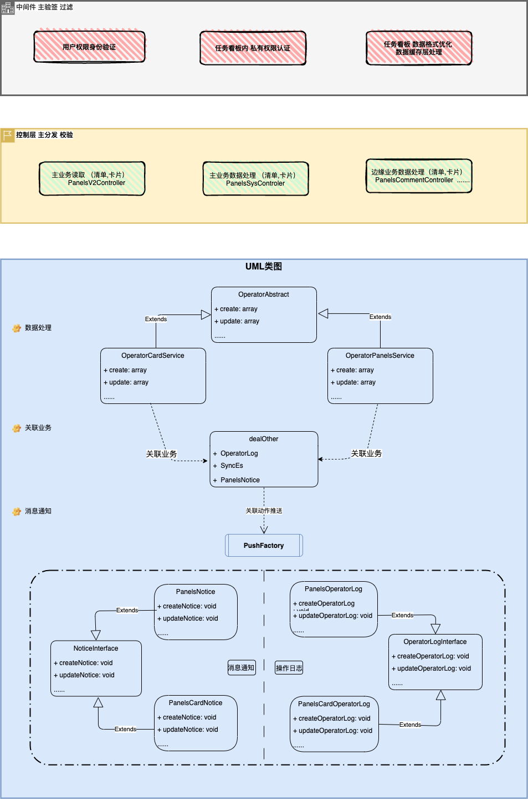

# 任务看板

## 主业务 实现类关系图

    - 增加 （清单，任务） 
    - 更新 （清单，任务） 
    - 删除 （清单，任务） 
    - 排序 （清单，任务）

## 服务层目录结构

    - Execute      核心业务处理
    - Factory      关联业务处理分发
    - Notice       关联业务-通知模块
    - OperatorLog  关联业务-操作日志模块

